<div align="center">



[](https://git.io/typing-svg)

</div>

```yaml
vishwajit@github:~$ whoami
Name:      Vishwajit Sarnobat
Role:      B.Tech Computer Engineering, SPIT Mumbai (2023-2027)
Currently: ISRO SAC -> NTRO -> Building VEGHA -> Barclays -> 47 repos and counting
Stack:     Python, Rust, C/C++, PyTorch, TensorFlow, Docker
OS:        Linux Mint (daily driver)
Focus:     Federated Learning, RL, Diffusion Models, Deepfake Detection, RADAR/Satellite ML
Location:  Mumbai, India
```

<div align="center">

### tech stack


</div>

---

### featured work

| Project | Description |
|---|---|
| **[INDRA-Sat-Diff](https://github.com/vishwajitsarnobat/INDRA-Sat-Diff)** | PyTorch Lightning framework for climate forecasting — a customizable, knowledge-aligned latent diffusion model for high-resolution precipitation prediction. Built during my ISRO SAC internship; underlies the INTROMET 2025 paper. |
| **[Cross-EfficientNet-ViT](https://github.com/vishwajitsarnobat/Cross-EfficientNet-ViT)** | Deepfake detection combining EfficientNet with Vision Transformers — the audio-visual half of the SIH 2024–winning Apex platform (98% accuracy). |
| **[PR-FIDS](https://github.com/vishwajitsarnobat/PR-FIDS)** | Federated intrusion/signal detection system in Python. |
| **[FDRL-Traffic](https://github.com/vishwajitsarnobat/FDRL-Traffic)** | Federated + PPO reinforcement learning for smart traffic signal control — the core of VEGHA, simulating a 28% congestion reduction. |
| **[HIKVISION-DVR-Tool](https://github.com/vishwajitsarnobat/HIKVISION-DVR-Tool)** | Reverse-engineered tooling for HIKVISION DVR systems. |
| **[Offline-Mobile-LLM](https://github.com/vishwajitsarnobat/Offline-Mobile-LLM)** | Running LLM inference fully offline on mobile hardware. |

47 repositories total → [browse them all](https://github.com/vishwajitsarnobat?tab=repositories)

---

### experience log

```yaml
2026 Jun - Aug   Barclays, Pune           | Technology Division, Summer Intern
2025 Aug - Nov   NTRO, New Delhi          | Deepfake detection systems, reverse engineering
2024 Dec - 2025  ISRO SAC, Ahmedabad      | Diffusion/GAN precipitation nowcasting, INTROMET 2025 paper
2023             SPIT (Dr. Y. S. Rao)     | Industrial DAQ: embedded C + Python GUI
```

---

<div align="center">

### achievements

🏆 Winner — India Innovate 2026 (National), Smart India Hackathon 2024, E-Cell SPIT Pitch Hunt 2023
🥈 Finalist — ISRO Bhartiya Antariksh Hackathon 2024
📄 Publications — INTROMET 2025 (ISRO), CNS paper accepted at IEEE Conference
⚔️ Codeforces — Pupil rank

</div>

---

<div align="center">


</div>

---

<div align="center">

[](https://www.linkedin.com/in/vishwajitsarnobat/)
[](mailto:sambhaji2772@gmail.com)

</div>
